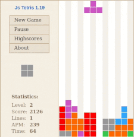

# TP1 - Tetris

El Tetris es un famoso videojuego de lógica estilo arcade de los años 80, en el cual el jugador debe ubicar distintas figuras que van cayendo en una grilla rectangular de modo de formar líneas horizontales.



## Estado del juego

El estado del juego se compone de dos elementos: la superficie consolidada y la pieza actual. Ambos elementos "conviven" en lo que se denomina la grilla del juego.

### Grilla del juego:
- El juego se desarrolla en una grilla rectangular de F filas y C columnas, formando así un total de F x C celdas.
- Una celda puede contener:
    - un fragmento de la superficie consolidada,
    - un fragmento de la pieza actual,
    - o puede estar vacía.
- Tanto la superficie como la pieza actual siempre deben estar dentro de la grilla.

## Desarrollo del juego

- El juego inicia con la grilla vacía (sin superficie) y la pieza "actual" arriba de todo centrada horizontalmente en la grilla. Esta es la "posición inicial" de las piezas.
- El juego se desarrolla en pasos o steps. Al final de cada step la pieza actual desciende una posición en la grilla.
- Si al finalizar el step la pieza no puede descender ya que colisionaría con la superficie consolidada o porque se iría por el límite inferior de la grilla, se debe consolidar la pieza con la superficie consolidad existente y agregar una nueva pieza en la posición inicial que pasará a ser la nueva pieza actual. Consolidar la pieza con la superficie implica que todas las celdas que están actualmente ocupadas por la pieza pasen a ser parte de la superficie.
- Si en la superficie se formara una línea horizontal cubriendo las C celdas, esa línea deberá ser eliminada y todas las filas superiores a esta deberán descender ocupando el lugar vacío.
- Durante cada step el jugador tiene la opción de mover la pieza actual libremente hacia la derecha o hacia la izquierda. El juego original permite también realizar una rotación de la pieza, que de momento no se va a implementar.

### Resolución:

- Si al intentar agregar una nueva pieza en la posición inicial la misma colisiona con la superficie consolidada se considera que a partir de ese momento el juego está terminado.

Como es común en los juegos de tipo arcade, el juego nunca se gana, sólo se vuelve más difícil hasta que eventualmente se pierde.

Hay una simplificación realizada respecto del juego original en este punto. En el juego original las piezas podían estar "parcialmente" en la grilla. En nuestro caso la pieza tiene que entrar completamente. Si no entra entonces consideramos el juego como terminado.

## Consigna

El objetivo de este trabajo es implementar las funciones para controlar la lógica principal del juego, sin interacción con el usuario. Para esto se provee el archivo tetris.py que contiene las definiciones y documentación de las funciones que se deben completar. Se debe leer y entender la documentación y escribir el código correspondiente.

Dentro del archivo van a encontrar varias definiciones como la siguiente:

```python
def crear_juego(pieza_inicial):
    """
    Crea un nuevo juego de Tetris.

    El parámetro pieza_inicial debe ser una pieza obtenida mediante 
    pieza.generar_pieza. Ver documentación de esa función para más información.

    El juego creado debe cumplir con lo siguiente:
    - La grilla está vacía: hay_superficie da False para todas las ubicaciones
    - La pieza actual está arriba de todo, en el centro de la pantalla.
    - El juego no está terminado: terminado(juego) da False

    Que la pieza actual esté arriba de todo significa que la coordenada Y de 
    sus posiciones superiores es 0 (cero).
    """
    return '???'
```

Se debe reemplazar return '???' con el código correspondiente.

*Nota: La función crear_juego que se muestra en el ejemplo no especifica en la documentación qué tipo de dato devuelve. Parte del objetivo del TP es que vos decidas cuál es la estructura de datos más apropiada para representar el juego. Cualquier función que requiera un juego como primer parámetro estará recibiendo un juego creado previamente con tu función crear_juego.*
*Si la estructura fue bien elegida la implementación de todas las funciones será sencilla.*

## Pruebas

Se dispone de un archivo de pruebas que permite verificar si la implementación cumple los requisitos mínimos e indispensables para realizar una entrega. Que las pruebas pasen no implican que el trabajo esté automáticamente aprobado ni que la implementación sea correcta.

Las pruebas no son exhaustivas ni mucho menos, sólamente realizan ciertas comprobaciones básicas para que puedas solucionar algunos errores sin tener que esperar la respuesta de tu corrector.

Para utilizarlo, copiá el archivo `tetris-test.py` en la misma carpeta que `tetris.py`, y ejecutá:

    python3 tetris-test.py

Si las pruebas pasan, se imprimirá un mensaje indicándolo. En caso contrario, se imprime un mensaje de error indicando el nombre de la prueba que falló.

Algunos tips por si las pruebas fallan
Cada prueba es una función dentro del archivo `tetris-test.py`. Si alguna prueba falla, te recomendamos que leas el código de la prueba para ver cómo solucionar el problema.

Las pruebas están ordenadas de forma más o menos incremental, lo cual implica que si la primer prueba falla probablemente fallen también las siguientes. Si más de una prueba da errores, tratá de solucionar primero el error de la primer prueba que haya fallado antes de intentar resolver los problemas de las pruebas siguientes.

## Material

Visitar [pagina de la materia](https://algoritmos1rw.ddns.net/tps/2020-c2/tp1)

# TP2 - Tetris++

El objetivo de este TP es completar la implementación del Tetris, agregando rotación de piezas, guardar/cargar partidas, puntuaciones, y una interfaz gráfica (utilizando Gamelib).

## Estructura del programa

Recomendamos tener al menos los siguientes archivos:

- `tetris.py`: el mismo que hiciste para el TP1. Si hiciste todo bien lo más probable es que no necesites modificar casi nada.
- `gamelib.py`: el mismo que usamos para el EJ2.
- `main.py`: acá implementaremos las nuevas funcionalidades.
- `piezas.txt`: definición de las rotaciones de las piezas.
- `teclas.txt`: configuración de teclas y acciones asociadas.
- `puntajes.txt`: donde se guardarán las puntuaciones.

Para el archivo `main.py` recomendamos comenzar con el siguiente esqueleto:

```python
import tetris
import gamelib

ESPERA_DESCENDER = 8

def main():
    # Inicializar el estado del juego
    gamelib.resize(400, 400)

    timer_bajar = ESPERA_DESCENDER
    while gamelib.loop(fps=30):
        gamelib.draw_begin()
        # Dibujar la pantalla
        gamelib.draw_end()

        for event in gamelib.get_events():
          if not event:
              break
          if event.type == gamelib.EventType.KeyPress:
              tecla = event.key
              # Actualizar el juego, según la tecla presionada

        timer_bajar -= 1
        if timer_bajar == 0:
            timer_bajar = ESPERA_DESCENDER
            # Descender la pieza automáticamente

gamelib.init(main)
```

## Interfaz gráfica

Al igual que en el EJ2, no hay un requerimiento fijo en cuanto a cómo tiene que lucir el juego: lo importante es que se pueda ver el estado del juego y la próxima pieza a salir. Mientras cumpla eso, la representación gráfica puede ser tan simple o compleja como quieras.

No es necesario para el trabajo, pero si decidís usar imágenes, guardalas en un carpeta llamada `img` que esté en el lugar donde está tu programa. Luego, para dibujar una de las imágenes en la ventana (por ejemplo `logo.gif`):

```python
gamelib.draw_image('img/logo.gif', x, y)
```

Es recomendable que el formato de las imágenes sea `gif`. Otros formatos pueden no funcionar correctamente.

## Controles

El jugador debe poder controlar el juego mediante el teclado, y la configuración de asignación de teclas a sus respectivas acciones se tomará de un archivo `teclas.txt`.

Cada línea del archivo tiene el formato `<tecla> = <acción>`, donde:

- `<tecla>` representa a una tecla del teclado, en el mismo formato que utiliza Gamelib (la variable tecla del esqueleto)
- `<acción>` es una de las acciones posibles en el juego:
    - `DERECHA`: mover pieza actual hacia la derecha
    - `IZQUIERDA`: mover pieza actual hacia la izquierda
    - `DESCENDER`: descender la pieza inmediatamente
    - `ROTAR`: rotar la pieza actual
    - `SALIR`: salir del juego

Cada acción puede estar asociada a más de uan tecla.

El archivo además puede tener líneas vacías, que deben ser ignoradas.

Ejemplo del archivo teclas.txt:

```
Up = ROTAR
Left = IZQUIERDA
Down = DESCENDER
Right = DERECHA

r = ROTAR
a = IZQUIERDA
s = DESCENDER
d = DERECHA
g = GUARDAR
c = CARGAR

Escape = SALIR
```

## Rotaciones

Para completar la implementación realizada en el TP1, obtendremos las rotaciones de cada pieza desde un archivo.

El archivo `piezas.txt` contiene una línea por cada pieza disponible. En cada una de las líneas encontrarán la siguiente información:

```
<pieza en rotación 0> <pieza en rotación 1> <pieza en rotación 2> <pieza en rotación 3> # Nombre pieza
```

Es decir, cada rotación separada del resto por un espacio. Cabe destacar que no todas las piezas tienen las 4 rotaciones. El cubo, por ejemplo, sólo tiene una orientación. El nombre de la pieza debe ser ignorado, es simplemente para que leer el archivo de piezas sea mas sencillo.

`<pieza en rotación 0>` son las posiciones que ocuparía la pieza si estuviera en el origen, separadas por un `;`. Por ejemplo, para la L tendríamos la siguiente rotación 0:

```
0,0;0,1;0,2;1,2
```

Esto indica que, en esa rotación, ocuparía las posiciones `0,0`, `0,1`, `0,2` y `1,2`. La línea completa del archivo describiendo a la L quedaría entonces:

```
0,0;0,1;0,2;1,2 0,0;0,1;1,0;2,0 0,0;1,0;1,1;1,2 0,0;1,0;2,0;2,-1
```

Si se desea, se pueden agregar más piezas con distinta forma.

Importante: la constante `PIEZAS` definida en el TP1 deberá ser reemplazada por la estructura cargada a partir del archivo.

## Algoritmo de rotación

Para realizar la rotación de las piezas se cuenta con el siguiente algoritmo que deberán implementar en su trabajo:

- Consideramos una pieza como una tupla de sus posiciones, por ejemplo, `(pos_1, pos_2, pos_3, pos_4)`.
- Ordenamos la tupla según sus coordenadas, de modo que `pos_1` pase a ser aquella que tiene menor valor de `x` y menor valor de `y`. Tip: usar `sorted`.
- Trasladamos la pieza actual al origen restandole `pos_1` a todas sus coordenadas.
- Con la pieza en el origen buscamos la siguiente rotación. Esto se hace a partir de comparar el resultado obtenido con lo leído del archivo.
- Trasladar la rotación a la ubicación original sumándole `pos_1` a todas sus coordenadas.

En código debería verse similar a lo siguiente:

```
pieza_ordenada = ordenar_por_coordenadas(pieza_a_rotar)
primer_posicion = pieza_ordenada[0]
pieza_en_origen = trasladar_pieza(pieza_ordenada, -primer_posicion)
siguiente_rotacion = buscar_rotacion(pieza_en_origen)
devolver trasladar_pieza(siguiente_rotacion, primer_posicion)
```

Es importante notar que queda a decisión del alumno como guardar la información de las rotaciones del archivo en memoria, para buscar la siguiente rotación de la pieza actual. Se hará hincapié en este asunto. Es recomendable que la estructura elegida, permita buscar la rotación de la manera más sencilla posible.

## Guardar partidas

El juego debe permitir guardar la partida en el estado actual y continuarla en otro momento. Para esto deberán definir un formato en el que almacenarán el estado del juego en un archivo.

No es necesario que el usuario ingrese un nombre de archivo cada vez que quiera guardar el juego; pueden hacer que siempre cree el mismo archivo y sobreescriba la última partida guardada.

Para guardar la partida se debe poder presionar una tecla durante el juego. Lo mismo para cargar una partida guardada. Al presionar la tecla correspondiente, el juego continuará a partir del estado del juego guardado.

## Puntuaciones

No le puede faltar a un buen juego de Tetris la puntuación. Son libres de decidir cómo contar los puntos: si por cantidad de piezas ubicadas, cantidad de líneas completas, tiempo transcurrido etc.

Una vez que la partida termina debido a que el usuario perdió, el juego revisará la tabla de puntuaciones más altas guardada en `puntuaciones.txt` y, si hay menos de 10 puntuaciones o si la puntuación del usuario es mayor que alguna de las puntuaciones del archivo; deberá pedirle el nombre(*) y agregar su puntuación al archivo.

Al finalizar el juego, deberá mostrar en la ventana las puntuaciones más altas.

(*) Pueden usar `gamelib.input` para pedirle el nombre al usuario. Funciona similar al `input` de Python, pero para la interfaz gráfica.

El archivo de puntuaciones no debe contener más de 10 puntuaciones. Si ya existen 10 puntuaciones y el usuario obtiene un puntaje mayor a alguno de la tabla, simplemente se eliminará el puntaje más bajo de los que estaban en la tabla para incorporar la nueva puntuación.

Nuevamente, el formato del archivo que usen lo eligirán ustedes. Puede ser tan simple como un archivo CSV con `nombre, puntuacion`.

## Recomendaciones

- Empiecen por la interfaz gráfica y el procesamiento del archivo de teclas. Es mucho más simple encontrar errores en las rotaciones teniendo ya una interfaz gráfica funcional que haciéndolo a "oscuras".
- La implementación del Tetris que hicieron para el TP1 les da un juego completamente funcional (con la salvedad de que no se pueden rotar las piezas).
- Dividan la función de dibujado en varias funciones que dibujen las distintas partes que compongan su ventana de juego: dibujar_grilla, dibujar_pieza, dibujar_siguiente, etc.
- Una vez que tengan la interfaz gráfica funcionando, recién ahí implementen la rotación de las piezas. No es un algoritmo muy complejo, pero sí requiere tiempo entender qué es lo que sucede.
- Analicen qué estructura de datos utilizar para determinar la rotación siguiente de las piezas.
- Recién cuando ya tengan funcionando la rotación y la interfaz agreguen guardar / restaurar partida y puntuaciones.
- El enunciado es largo pero el código no es tan complejo como parece. Es clave entender bien qué es lo que se pide y qué hay que implementar antes de ponerse a escribir código.

## Cambios sobre el TP1

No es necesario realizar grandes cambios sobre la implementación del TP1. Como recomendación general les damos las firmas de tres funciones para agregar en `tetris.py` que les pueden ser de utilidad:

- `rotar(juego, rotaciones)`: De la misma forma que mover, rotar debería rotar la pieza actual; para esto recibe el juego y un parámetro adicional con la información sobre las rotaciones.
- `guardar_partida(juego, ruta)`: Guarda el juego en el estado actual en un archivo
- `cargar_partida(ruta)`: Carga una partida guardada desde un archivo. Devuelve un estado del juego, de forma similar a `crear_juego`, pero en este caso el estado no es inicial, sino que es el mismo estado que se guardó.

Además, como ya se mencionó, la constante `PIEZAS` deberá ser reemplazada por la estructura cargada a partir del archivo.

El resto de las funcionalidades las pueden implementar directamente en el TP2 sin modificar el TP1. Podrían llegar a necesitar algún cambio más si para las puntuaciones deciden hacer algo relativamente complejo (como ver cuántas líneas fueron eliminadas), pero esto no es necesario para el trabajo.

## Material

Visitar la [pagina de la materia](https://algoritmos1rw.ddns.net/tps/2020-c2/tp2)